# python_labs


## Лабораторная работа 7

### A.Тесты для src/lib/text.py
```python
import pytest
from src.lib.text import normalize, tokenize, count_freq, top_n


@pytest.mark.parametrize(
    "source, expected",
    [
        ("ПрИвЕт\nМИр\t", "привет мир"),
        ("ёжик, Ёлка", "ежик, елка"),
        ("Hello\r\nWorld", "hello world"),
        ("  двойные   пробелы  ", "двойные пробелы"),
        ("", ""),
        ("   ", ""),
    ],
)
def test_normalize(source, expected):
    assert normalize(source) == expected


@pytest.mark.parametrize(
    "text, expected",
    [
        ("привет мир", ["привет", "мир"]),
        ("hello world test", ["hello", "world", "test"]),
        ("", []),
        ("   ", []),
        ("знаки, препинания! тест.", ["знаки", "препинания", "тест"]),
    ],
)
def test_tokenize(text, expected):
    assert tokenize(text) == expected


def test_count_freq_basic():
    tokens = ["apple", "banana", "apple", "cherry", "banana", "apple"]
    result = count_freq(tokens)
    expected = {"apple": 3, "banana": 2, "cherry": 1}
    assert result == expected


def test_count_freq_empty():
    assert count_freq([]) == {}


def test_top_n_basic():
    freq = {"apple": 5, "banana": 3, "cherry": 7, "date": 1}
    result = top_n(freq, 2)
    expected = [("cherry", 7), ("apple", 5)]
    assert result == expected


def test_top_n_tie_breaker():
    freq = {"banana": 3, "apple": 3, "cherry": 3}
    result = top_n(freq, 3)
    expected = [("apple", 3), ("banana", 3), ("cherry", 3)]
    assert result == expected


def test_top_n_empty():
    assert top_n({}, 5) == []


def test_full_pipeline():
    text = "Привет мир! Привет всем. Мир прекрасен."
    normalized = normalize(text)
    tokens = tokenize(normalized)
    freq = count_freq(tokens)
    top_words = top_n(freq, 2)

    assert normalized == "привет мир! привет всем. мир прекрасен."
    assert tokens == ["привет", "мир", "привет", "всем", "мир", "прекрасен"]
    assert freq == {"привет": 2, "мир": 2, "всем": 1, "прекрасен": 1}
    assert top_words == [("мир", 2), ("привет", 2)]

```


### B.Тесты для src/lab05/json_csv.py

```python
import pytest
import json
import csv
from src.lab05.json_csv import json_to_csv, csv_to_json


# Успешные тесты JSON -> CSV
@pytest.mark.parametrize(
    "data,expected",
    [
        ([{"name": "Alice", "age": 25}, {"name": "Bob", "age": 30}], 2),
        ([{"name": "Alice", "active": True, "score": 95.5}], 1),
        ([{"name": "Alice", "comment": ""}], 1),
        ([{"name": "Алиса", "message": "Привет!"}], 1),
        ([{"name": "Alice", "age": None}], 1),
        ([{"id": 1, "value": "test"}], 1),
        ([{"a": 1}, {"a": 2}, {"a": 3}], 3),
        ([{"x": "test1"}, {"x": "test2"}], 2),
    ],
)
def test_json_to_csv_success(tmp_path, data, expected):
    src = tmp_path / "test.json"
    dst = tmp_path / "test.csv"
    src.write_text(json.dumps(data), encoding="utf-8")
    json_to_csv(str(src), str(dst))
    with dst.open(encoding="utf-8") as f:
        rows = list(csv.DictReader(f))
    assert len(rows) == expected


# Успешные тесты CSV -> JSON
@pytest.mark.parametrize(
    "content,expected",
    [
        ("name,age\nAlice,25\nBob,30", 2),
        ('name,desc\n"Alice","Test"', 1),
        ("name;age\nAlice;25\nBob;30", 2),
        ('name,age\n"Alice","25"\n"Bob","30"', 2),
        ("name,age,city\nAlice,25,\nBob,30,London", 2),
        ("name\nAlice\nBob", 2),
        ("id,name,age\n1,Alice,25\n2,Bob,30", 2),
        ("first,last\nJohn,Doe\nJane,Smith", 2),
        ("a,b,c\n1,2,3\n4,5,6", 2),
        ("col1\nval1\nval2", 2),
    ],
)
def test_csv_to_json_success(tmp_path, content, expected):
    src = tmp_path / "test.csv"
    dst = tmp_path / "test.json"
    src.write_text(content, encoding="utf-8")
    csv_to_json(str(src), str(dst))
    with dst.open(encoding="utf-8") as f:
        data = json.load(f)
    assert len(data) == expected


# Тесты ошибок JSON
@pytest.mark.parametrize(
    "content,error",
    [
        (None, FileNotFoundError),
        ("{ invalid json }", ValueError),
        ("", ValueError),
        ('{"name": "test"}', ValueError),
        ("[]", ValueError),
        (b"\xff\xfe", ValueError),
        ('[{"name": "test"},]', ValueError),
        ('[{"name": "test}]', ValueError),
    ],
)
def test_json_to_csv_errors(tmp_path, content, error):
    dst = tmp_path / "output.csv"
    if content is None:
        with pytest.raises(error):
            json_to_csv("nonexistent.json", str(dst))
    else:
        src = tmp_path / "test.json"
        if isinstance(content, bytes):
            src.write_bytes(content)
        else:
            src.write_text(content, encoding="utf-8")
        with pytest.raises(error):
            json_to_csv(str(src), str(dst))


# Тесты ошибок CSV
@pytest.mark.parametrize(
    "content,error",
    [
        (None, FileNotFoundError),
        ("", ValueError),
        (b"\xff\xfe", ValueError),
    ],
)
def test_csv_to_json_errors(tmp_path, content, error):
    dst = tmp_path / "output.json"
    if content is None:
        with pytest.raises(error):
            csv_to_json("nonexistent.csv", str(dst))
    else:
        src = tmp_path / "test.csv"
        if isinstance(content, bytes):
            src.write_bytes(content)
        else:
            src.write_text(content, encoding="utf-8")
        with pytest.raises(error):
            csv_to_json(str(src), str(dst))


# Специальные тесты
def test_json_csv_roundtrip(tmp_path):
    original = tmp_path / "original.json"
    csv_file = tmp_path / "intermediate.csv"
    final = tmp_path / "final.json"
    data = [{"name": "Alice", "age": 25}, {"name": "Bob", "age": 30}]
    original.write_text(json.dumps(data), encoding="utf-8")
    json_to_csv(str(original), str(csv_file))
    csv_to_json(str(csv_file), str(final))
    with final.open(encoding="utf-8") as f:
        result = json.load(f)
    assert len(result) == 2
    assert result[0]["name"] == "Alice"


def test_csv_only_header(tmp_path):
    src = tmp_path / "header.csv"
    dst = tmp_path / "output.json"
    src.write_text("name,age", encoding="utf-8")
    csv_to_json(str(src), str(dst))
    with dst.open(encoding="utf-8") as f:
        data = json.load(f)
    assert len(data) == 0


def test_wrong_extension_json(tmp_path):
    src = tmp_path / "test.txt"
    dst = tmp_path / "test.csv"
    src.write_text('[{"name": "test"}]', encoding="utf-8")
    with pytest.raises(ValueError):
        json_to_csv(str(src), str(dst))


def test_wrong_extension_csv(tmp_path):
    src = tmp_path / "test.txt"
    dst = tmp_path / "test.json"
    src.write_text("name,age\nAlice,25", encoding="utf-8")
    with pytest.raises(ValueError):
        csv_to_json(str(src), str(dst))


# Дополнительные тесты
def test_large_dataset(tmp_path):
    src = tmp_path / "large.json"
    dst = tmp_path / "large.csv"
    data = [{"id": i} for i in range(10)]
    src.write_text(json.dumps(data), encoding="utf-8")
    json_to_csv(str(src), str(dst))
    with dst.open(encoding="utf-8") as f:
        rows = list(csv.DictReader(f))
    assert len(rows) == 10


def test_special_chars_json(tmp_path):
    src = tmp_path / "test.json"
    dst = tmp_path / "test.csv"
    data = [{"text": "Hello", "quotes": 'Text "quotes"'}]
    src.write_text(json.dumps(data), encoding="utf-8")
    json_to_csv(str(src), str(dst))
    assert dst.exists()


def test_empty_values_csv(tmp_path):
    src = tmp_path / "test.csv"
    dst = tmp_path / "test.json"
    src.write_text("name,age,city\nAlice,25,\nBob,,London", encoding="utf-8")
    csv_to_json(str(src), str(dst))
    with dst.open(encoding="utf-8") as f:
        data = json.load(f)
    assert len(data) == 2


def test_boolean_values(tmp_path):
    src = tmp_path / "test.json"
    dst = tmp_path / "test.csv"
    data = [{"flag": True, "active": False}]
    src.write_text(json.dumps(data), encoding="utf-8")
    json_to_csv(str(src), str(dst))
    with dst.open(encoding="utf-8") as f:
        rows = list(csv.DictReader(f))
    assert rows[0]["flag"] == "True"


def test_single_row_csv(tmp_path):
    src = tmp_path / "test.csv"
    dst = tmp_path / "test.json"
    src.write_text("name,age\nAlice,25", encoding="utf-8")
    csv_to_json(str(src), str(dst))
    with dst.open(encoding="utf-8") as f:
        data = json.load(f)
    assert len(data) == 1


def test_comma_in_quotes(tmp_path):
    src = tmp_path / "test.csv"
    dst = tmp_path / "test.json"
    src.write_text('name,address\n"Alice","Street 1, Apt 2"', encoding="utf-8")
    csv_to_json(str(src), str(dst))
    with dst.open(encoding="utf-8") as f:
        data = json.load(f)
    assert data[0]["address"] == "Street 1, Apt 2"


def test_content_validation_json_to_csv(tmp_path):
    src = tmp_path / "test.json"
    dst = tmp_path / "test.csv"
    data = [{"name": "Alice", "age": 25}, {"name": "Bob", "age": 30}]
    src.write_text(json.dumps(data), encoding="utf-8")
    json_to_csv(str(src), str(dst))
    with dst.open(encoding="utf-8") as f:
        reader = csv.DictReader(f)
        rows = list(reader)
    assert set(rows[0].keys()) == {"name", "age"}
    assert rows[0]["name"] == "Alice"


def test_content_validation_csv_to_json(tmp_path):
    src = tmp_path / "test.csv"
    dst = tmp_path / "test.json"
    src.write_text("name,age,score\nAlice,25,95.5\nBob,30,88.0", encoding="utf-8")
    csv_to_json(str(src), str(dst))
    with dst.open(encoding="utf-8") as f:
        data = json.load(f)
    assert data[0]["name"] == "Alice"
    assert data[0]["age"] == "25"


def test_unicode_content(tmp_path):
    src = tmp_path / "test.csv"
    dst = tmp_path / "test.json"
    src.write_text("text\nПривет", encoding="utf-8")
    csv_to_json(str(src), str(dst))
    with dst.open(encoding="utf-8") as f:
        data = json.load(f)
    assert len(data) == 1


def test_multiple_roundtrips(tmp_path):
    for i in range(3):
        json_file = tmp_path / f"test{i}.json"
        csv_file = tmp_path / f"test{i}.csv"
        final_json = tmp_path / f"final{i}.json"
        data = [{"id": i, "value": f"test{i}"}]
        json_file.write_text(json.dumps(data), encoding="utf-8")
        json_to_csv(str(json_file), str(csv_file))
        csv_to_json(str(csv_file), str(final_json))
        with final_json.open(encoding="utf-8") as f:
            result = json.load(f)
        assert len(result) == 1


def test_numeric_data(tmp_path):
    src = tmp_path / "test.json"
    dst = tmp_path / "test.csv"
    data = [{"number": 123, "float": 45.67}]
    src.write_text(json.dumps(data), encoding="utf-8")
    json_to_csv(str(src), str(dst))
    with dst.open(encoding="utf-8") as f:
        rows = list(csv.DictReader(f))
    assert rows[0]["number"] == "123"


def test_mixed_data_types(tmp_path):
    src = tmp_path / "test.csv"
    dst = tmp_path / "test.json"
    src.write_text("string,number,boolean\nhello,123,true", encoding="utf-8")
    csv_to_json(str(src), str(dst))
    with dst.open(encoding="utf-8") as f:
        data = json.load(f)
    assert data[0]["string"] == "hello"
    assert data[0]["number"] == "123"

```

### Проверка стиль кода

```python
black.
```
```python
black --check .
```
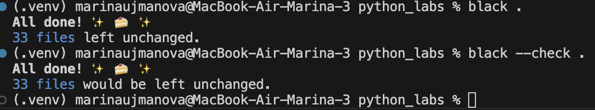

### Запуск тестов
### Для text.py
```python
python -m pytest tests/test_text.py -v
```

### Для json_csv.py
```python
python -m pytest tests/test_json_csv.py -v
```
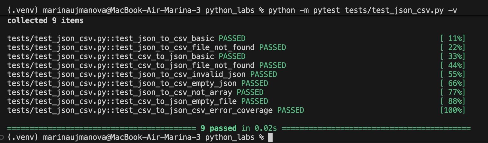

### Проверка покрытости

```python
python -m pytest --cov=src --cov-report=term-missing
```
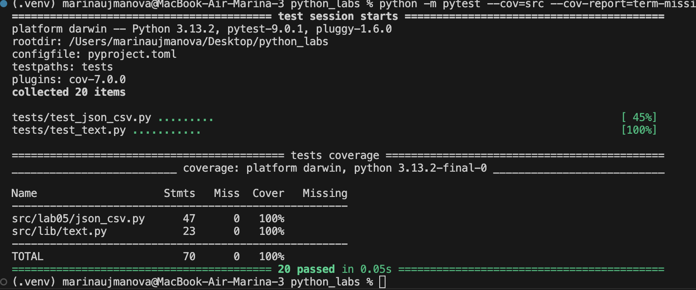

### Дополнительное задание 
```python
pytest -v
```
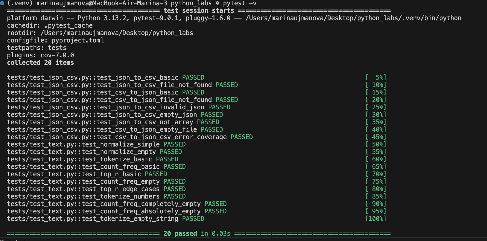


## Лабораторная работа 6

### cli_text
```python
import argparse
from pathlib import Path
import sys
import os

# Добавляю путь к src, чтобы можно было использовать lib/text.py
sys.path.append(os.path.join(os.path.dirname(__file__), ".."))

from lib.text import normalize, tokenize, count_freq, top_n


def read_text_file(path: Path) -> str:
    return path.read_text(encoding="utf-8")


def command_cat(input_path: str, number_lines: bool) -> None:
    path = Path(input_path)

    if not path.is_file():
        print(f"Ошибка: файл '{path}' не найден.", file=sys.stderr)
        raise FileNotFoundError(path)

    with path.open(encoding="utf-8") as f:
        if number_lines:
            for idx, line in enumerate(f, start=1):
                print(f"{idx}\t{line.rstrip()}")
        else:
            for line in f:
                print(line.rstrip())


def command_stats(input_path: str, top_count: int) -> None:
    path = Path(input_path)

    if not path.is_file():
        print(f"Ошибка: файл '{path}' не найден.", file=sys.stderr)
        raise FileNotFoundError(path)

    text = read_text_file(path)
    if not text.strip():
        print("Файл пуст — статистику не посчитать.", file=sys.stderr)
        return

    normalized = normalize(text, casefold=True, yo2e=True)
    tokens = tokenize(normalized)
    freq = count_freq(tokens)
    top_words = top_n(freq, top_count)

    print(f"Топ-{top_count} слов в файле '{input_path}':")

    max_len = max(len(word) for word, _ in top_words)
    for word, count in top_words:
        print(f"{word.ljust(max_len)}   {count}")


def build_parser() -> argparse.ArgumentParser:
    parser = argparse.ArgumentParser(
        description="CLI для работы с текстом (cat и stats)"
    )
    subparsers = parser.add_subparsers(
        dest="command",
        title="Команды",
        description="Доступные подкоманды: cat и stats",
    )

    # cat
    cat_parser = subparsers.add_parser(
        "cat",
        help="- Показать содержимое файла. В конце команды можно указать -n для нумерации строк",
    )
    cat_parser.add_argument("--input", required=True, help="Путь к файлу")
    cat_parser.add_argument(
        "-n",
        dest="number",
        action="store_true",
        help="Нумерация строк",
    )

    # stats
    stats_parser = subparsers.add_parser(
        "stats",
        help="- Статистика слов. В конце команды можно указать --top N для вывода топ-N слов (по умолчанию 5)",
    )
    stats_parser.add_argument("--input", required=True, help="Путь к файлу")
    stats_parser.add_argument(
        "--top",
        type=int,
        default=5,
        help="Сколько слов выводить",
    )

    return parser


def main(argv=None) -> None:
    # argv == None -> берем реальные аргументы командной строки
    if argv is None:
        argv = sys.argv[1:]

    # 1) Если вообще нет аргументов — короткая подсказка
    if not argv:
        print("CLI для работы с текстом (cat и stats)\n")
        print("Команды:")
        print("  cat   - Показать содержимое файла")
        print("  stats - Статистика слов\n")
        print("Использование:")
        print(
            "  python3 src/lab_06/cli_text.py (cat/stats) --input data/samples/файл\n"
        )
        return

    # 2) Если спрашивают общий help (--help или -h) — полная инструкция
    if argv[0] in ("-h", "--help"):
        print("Общий CLI\n")
        print("Команды:")
        print("  cat - Показать содержимое файла")
        print("  stats - Статистика слов\n")
        print("Дополнительно:")
        print("  python3 src/lab_06/cli_text.py cat --help")
        print("  python3 src/lab_06/cli_text.py stats --help\n")
        return

    # 3) Отдельный help для cat
    if argv[0] == "cat" and len(argv) >= 2 and argv[1] in ("-h", "--help"):
        print("Справка по команде: cat\n")
        print("Назначение:")
        print("  Показать содержимое текстового файла, построчно.\n")
        print("Параметры:")
        print("  --input ПУТЬ    Путь к файлу (обязателен)")
        print("  -n              Нумеровать строки\n")
        print("Примеры:")
        print("  python3 src/lab_06/cli_text.py cat --input data/samples/файл")
        print("  python3 src/lab_06/cli_text.py cat --input data/samples/файл -n\n")
        return

    # 4) Отдельный help для stats
    if argv[0] == "stats" and len(argv) >= 2 and argv[1] in ("-h", "--help"):
        print("Справка по команде: stats\n")
        print("Назначение:")
        print("  Показать топ-N самых частых слов в файле.\n")
        print("Параметры:")
        print("  --input ПУТЬ    Путь к файлу (обязателен)")
        print("  --top N         Сколько слов вывести (по умолчанию 5)\n")
        print("Примеры:")
        print("  python3 src/lab_06/cli_text.py stats --input data/samples/файл")
        print(
            "  python3 src/lab_06/cli_text.py stats --input data/samples/файл --top 10\n"
        )
        return

    # 5) Все остальные случаи — обычный разбор команд
    parser = build_parser()
    args = parser.parse_args(argv)

    try:
        if args.command == "cat":
            command_cat(args.input, args.number)
        elif args.command == "stats":
            command_stats(args.input, args.top)
    except FileNotFoundError:
        sys.exit(1)


if __name__ == "__main__":
    main()
```

### stats
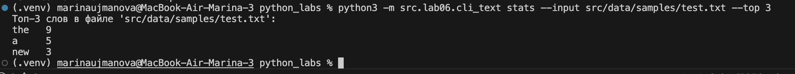
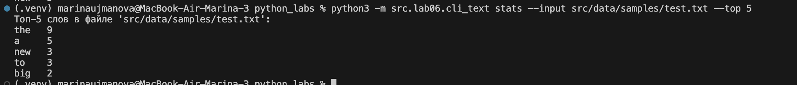


### cli_convert

```python
import argparse
import os
import sys

# Прямое добавление пути к lab05
sys.path.append(os.path.join(os.path.dirname(__file__), '..', 'lab05'))

try:
    import csv_xlsx
    import json_csv
except ImportError as e:
    print(f"Ошибка импорта: {e}")
    sys.exit(1)

def validate_file_extension(filename, allowed_extensions):
    """Проверяет, что файл имеет одно из разрешенных расширений"""
    file_ext = os.path.splitext(filename)[1].lower()
    if file_ext not in allowed_extensions:
        raise ValueError(f"Файл должен иметь одно из расширений {allowed_extensions}: {filename}")

def validate_json2csv_files(input_file, output_file):
    """Проверяет форматы файлов для конвертации JSON в CSV"""
    validate_file_extension(input_file, ['.json'])
    validate_file_extension(output_file, ['.csv'])

def validate_csv2json_files(input_file, output_file):
    """Проверяет форматы файлов для конвертации CSV в JSON"""
    validate_file_extension(input_file, ['.csv'])
    validate_file_extension(output_file, ['.json'])

def validate_csv2xlsx_files(input_file, output_file):
    """Проверяет форматы файлов для конвертации CSV в XLSX"""
    validate_file_extension(input_file, ['.csv'])
    validate_file_extension(output_file, ['.xlsx'])

def main():
    parser = argparse.ArgumentParser(
        description="CLI-конвертер данных между форматами JSON, CSV и XLSX",
        formatter_class=argparse.RawDescriptionHelpFormatter
    )
    subparsers = parser.add_subparsers(dest="command", help="Доступные команды конвертации")

    # Подкоманда json2csv
    json2csv_parser = subparsers.add_parser("json2csv", help="Конвертировать JSON в CSV")
    json2csv_parser.add_argument("--in", dest="input", required=True, help="Входной JSON файл")
    json2csv_parser.add_argument("--out", dest="output", required=True, help="Выходной CSV файл")

    # Подкоманда csv2json
    csv2json_parser = subparsers.add_parser("csv2json", help="Конвертировать CSV в JSON")
    csv2json_parser.add_argument("--in", dest="input", required=True, help="Входной CSV файл")
    csv2json_parser.add_argument("--out", dest="output", required=True, help="Выходной JSON файл")

    # Подкоманда csv2xlsx
    csv2xlsx_parser = subparsers.add_parser("csv2xlsx", help="Конвертировать CSV в XLSX")
    csv2xlsx_parser.add_argument("--in", dest="input", required=True, help="Входной CSV файл")
    csv2xlsx_parser.add_argument("--out", dest="output", required=True, help="Выходной XLSX файл")

    args = parser.parse_args()

    try:
        if args.command == "json2csv":
            validate_json2csv_files(args.input, args.output)
            json_csv.json_to_csv(args.input, args.output)
            print(f"Успешно: {args.input} -> {args.output}")
            
        elif args.command == "csv2json":
            validate_csv2json_files(args.input, args.output)
            json_csv.csv_to_json(args.input, args.output)
            print(f"Успешно: {args.input} -> {args.output}")
            
        elif args.command == "csv2xlsx":
            validate_csv2xlsx_files(args.input, args.output)
            csv_xlsx.csv_to_xlsx(args.input, args.output)
            print(f"Успешно: {args.input} -> {args.output}")
            
        else:
            parser.print_help()
            
    except FileNotFoundError as e:
        print(f"Ошибка: Файл не найден - {e}", file=sys.stderr)
        sys.exit(1)
    except ValueError as e:
        print(f"Ошибка: Неверные данные или формат файла - {e}", file=sys.stderr)
        sys.exit(1)
    except Exception as e:
        print(f"Неожиданная ошибка: {e}", file=sys.stderr)
        sys.exit(1)

if __name__ == "__main__":
    main()
```

### help
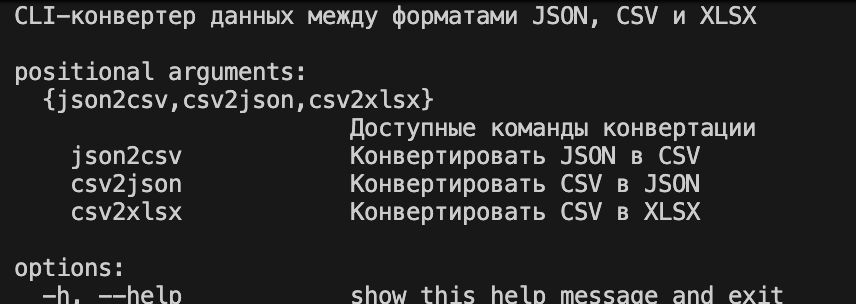


### json2csv
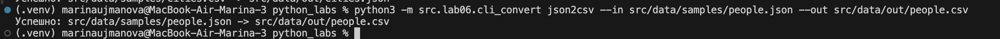
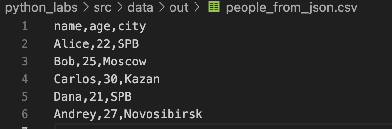

### csv2json
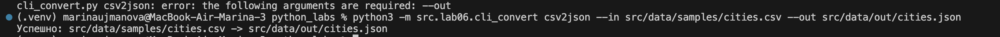
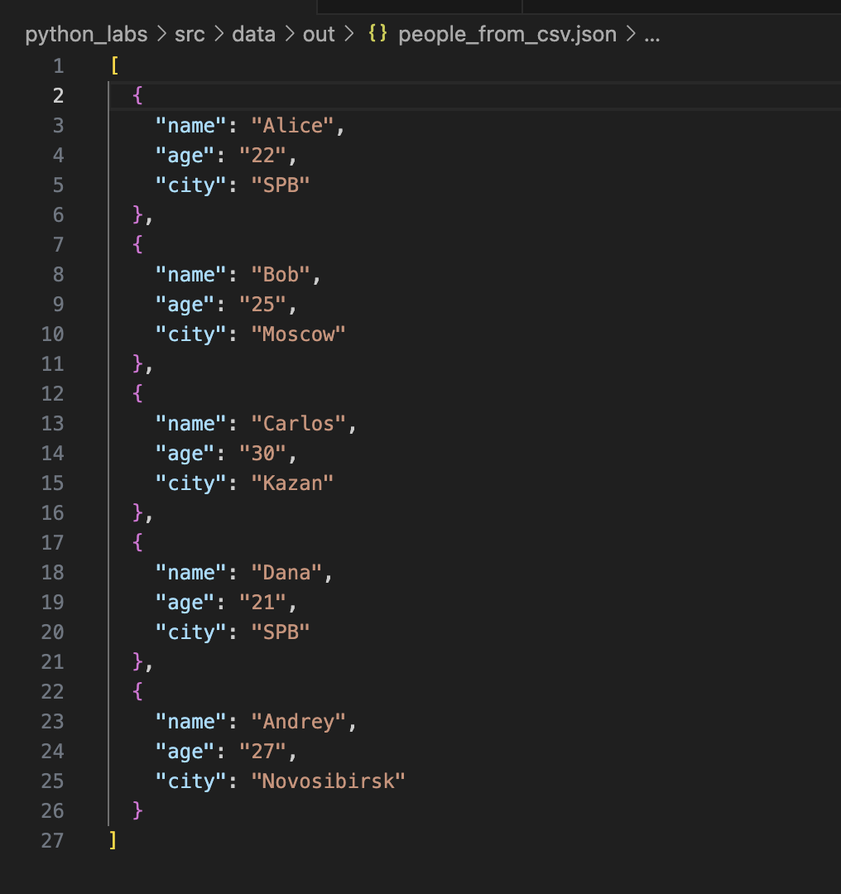

### csv2xlsx
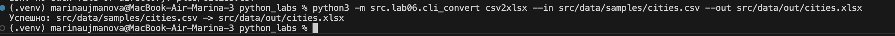


## Лабораторная работа 5

### Задание A
```python
import json
import csv
from pathlib import Path

def ensure_relative(path: Path) -> None:
    if path.is_absolute():
        raise ValueError("Путь должен быть относительным")

def json_to_csv(json_path: str, csv_path: str) -> None:

    json_file = Path(json_path)
    csv_file = Path(csv_path)
    ensure_relative(json_path)
    ensure_relative(csv_path)

    if not json_file.exists():
        raise FileNotFoundError(f"Файл {json_path} не найден")
    
    if json_file.suffix.lower() != '.json':
        raise ValueError("Неверный тип файла. Ожидается .json")
    
    try:
        with json_file.open('r', encoding='utf-8') as f:
            data = json.load(f)
    except json.JSONDecodeError as e:
        raise ValueError(f"Ошибка чтения JSON: {e}")
    
    if not data:
        raise ValueError("Пустой JSON или неподдерживаемая структура")
    
    if not isinstance(data, list):
        raise ValueError("JSON должен содержать список объектов")
    
    if not all(isinstance(item, dict) for item in data):
        raise ValueError("Все элементы JSON должны быть словарями")
    
    all_keys = set()
    for item in data:
        all_keys.update(item.keys())

    if data:
        first_item_keys = list(data[0].keys())
        remaining_keys = sorted(all_keys - set(first_item_keys))
        fieldnames = first_item_keys + remaining_keys
    else:
        fieldnames = sorted(all_keys)
    # Запись в CSV
    try:
        with csv_file.open('w', newline='', encoding='utf-8') as f:
            writer = csv.DictWriter(f, fieldnames=fieldnames)
            writer.writeheader()
            for row in data:
                complete_row = {key: row.get(key, '') for key in fieldnames}
                writer.writerow(complete_row)
    except Exception as e:
        raise ValueError(f"Ошибка записи CSV: {e}")

def csv_to_json(csv_path: str, json_path: str) -> None:
  
    csv_file = Path(csv_path)
    json_file = Path(json_path)
    
    if not csv_file.exists():
        raise FileNotFoundError(f"Файл {csv_path} не найден")

    if csv_file.suffix.lower() != '.csv':
        raise ValueError("Неверный тип файла. Ожидается .csv")
    
    try:
        with csv_file.open('r', encoding='utf-8') as f:
            reader = csv.DictReader(f)
            if reader.fieldnames is None:
                raise ValueError("CSV файл не содержит заголовка")
            
            data = list(reader)
            
    except Exception as e:
        raise ValueError(f"Ошибка чтения CSV: {e}")

    if not data:
        raise ValueError("Пустой CSV файл")

    try:
        with json_file.open('w', encoding='utf-8') as f:
            json.dump(data, f, ensure_ascii=False, indent=2)
    except Exception as e:
        raise ValueError(f"Ошибка записи JSON: {e}")

json_to_csv("src/data/samples/people.json", "/src/data/out/people_from_json.csv")
csv_to_json("src/data/samples/people.csv", "src/data/out/people_from_csv.json")
```

### Входные данные
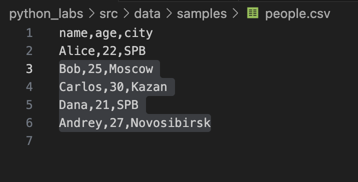
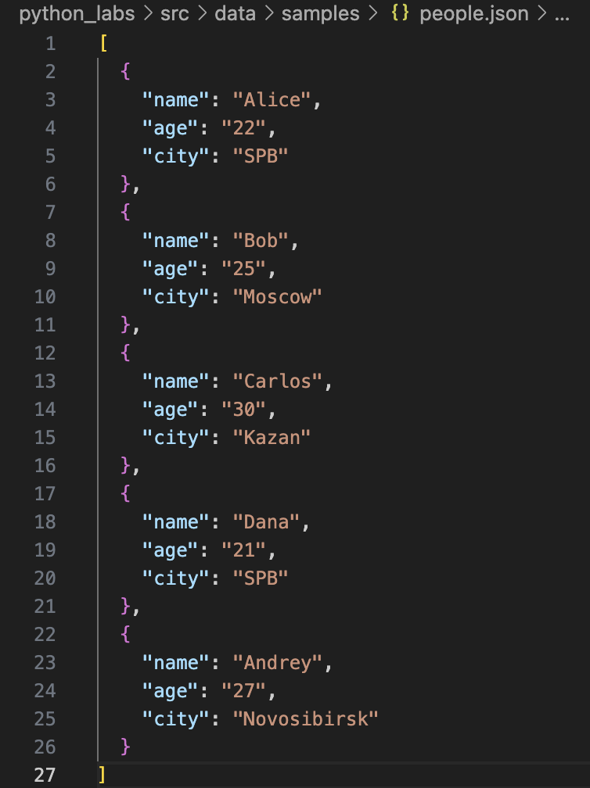

### Выходные данные
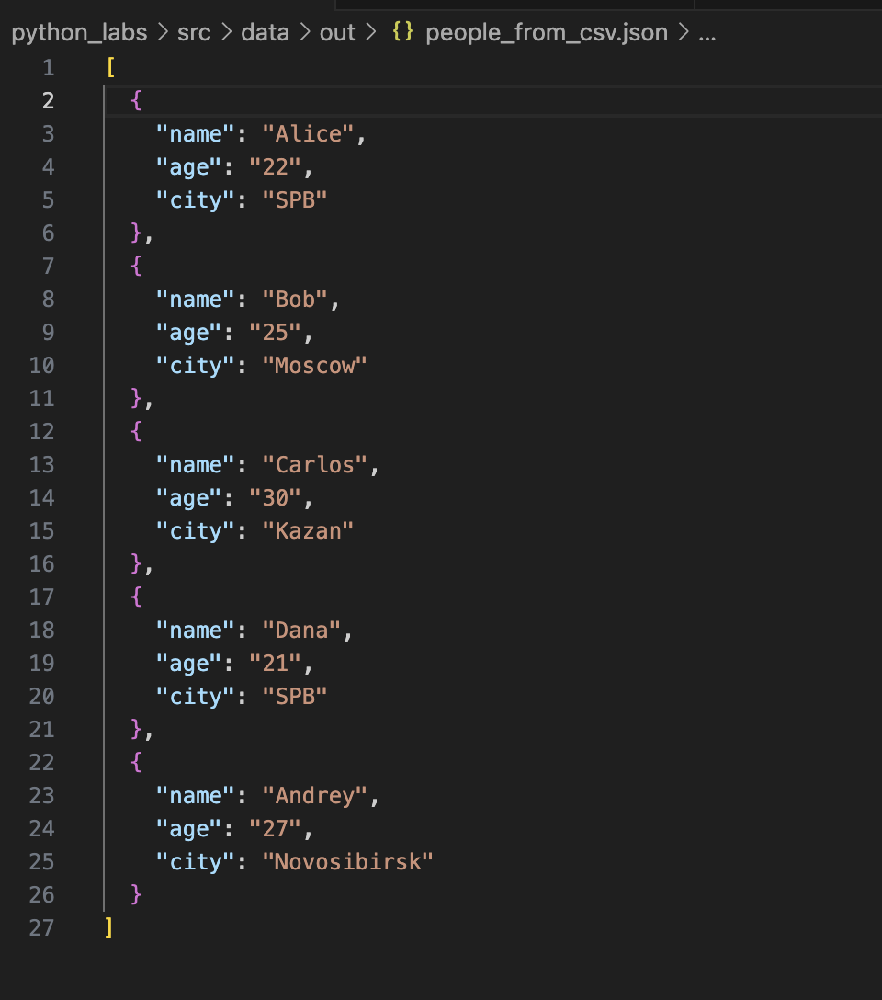
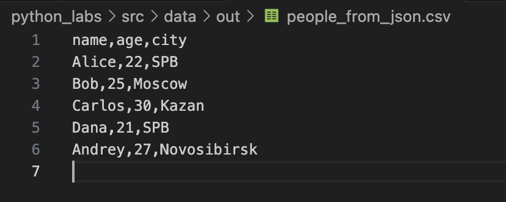


### Задание B
```python
import csv
from pathlib import Path
from openpyxl import Workbook
from openpyxl.utils import get_column_letter


def csv_to_xlsx(csv_path: str, xlsx_path: str) -> None:

    csv_file = Path(csv_path)
    xlsx_file = Path(xlsx_path)
    
    if not csv_file.exists():
        raise FileNotFoundError(f"Файл {csv_path} не найден")
    
    if csv_file.suffix.lower() != '.csv':
        raise ValueError("Неверный тип файла. Ожидается .csv")
    
    # Чтение CSV
    try:
        with csv_file.open('r', encoding='utf-8') as f:
            reader = csv.reader(f)
            rows = list(reader)
    except Exception as e:
        raise ValueError(f"Ошибка чтения CSV: {e}")
    
    if not rows:
        raise ValueError("Пустой CSV файл")
    
    if not rows[0]:
        raise ValueError("CSV файл не содержит заголовка")
    
    # Создание XLSX
    try:
        wb = Workbook()
        ws = wb.active
        ws.title = "Sheet1"
        
        for row in rows:
            ws.append(row)
        
        
        for col_idx, column_cells in enumerate(ws.columns, 1):
            max_length = 8  
            column_letter = get_column_letter(col_idx)
            
            for cell in column_cells:
                try:
                    if cell.value:

                        cell_length = len(str(cell.value))
                        if cell_length > max_length:
                            max_length = cell_length
                except:
                    pass
            
            adjusted_width = max_length + 2
            ws.column_dimensions[column_letter].width = adjusted_width
        
        wb.save(xlsx_file)
        
    except Exception as e:
        raise ValueError(f"Ошибка создания XLSX: {e}")
    
csv_to_xlsx("src/data/samples/people.csv", "src/data/out/people.xlsx")
```

### Входные данные


### Выходные данные
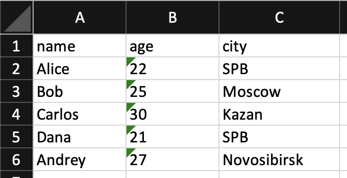


## Лабораторная работа 4

### Задание A
```python
import csv
from pathlib import Path
from typing import Iterable, Sequence
def read_text(path: str | Path, encoding: str = "utf-8") -> str:
    try:
        return Path(path).read_text(encoding=encoding)
    except FileNotFoundError:
        return "Такого файла нету"
    except UnicodeDecodeError:
        return "Неудалось изменить кодировку"

def write_csv(rows: list[tuple | list], path: str | Path, header: tuple[str, ...] | None = None) -> None:
    p = Path(path)
    with p.open('w', encoding="utf-8") as file:
        f = csv.writer(file)   
        if header is None and rows == []:
            file_c.writerow(('a', 'b'))
        if header is not None:
            f.writerow(header)
        if rows != []:
            const = len(rows[0])
            for i in rows:
                if len(i) != const:
                    return ValueError
        f.writerows(rows)

def ensure_parent_dir(path: str | Path) -> None:
    Path(path).parent.mkdir(parents=True, exist_ok=True)

print(read_text(r"/Users/marinaujmanova/Desktop/python_labs/src/lab04/data/input.txt"))
write_csv([("word","count"),("test",3)], r"/Users/marinaujmanova/Desktop/python_labs/src/lab04/data/check.csv")
```
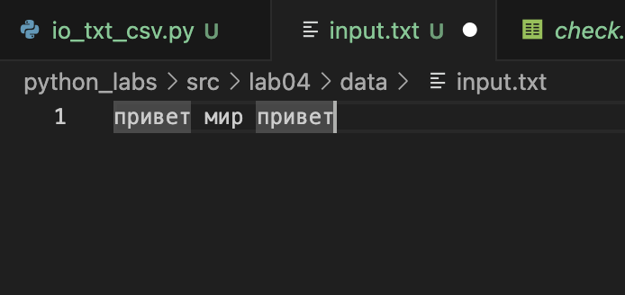
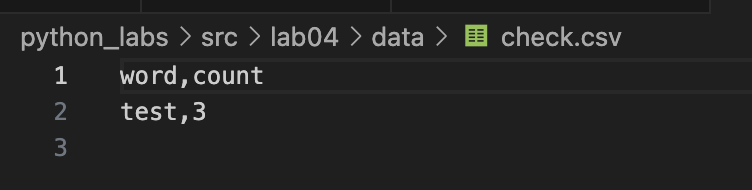


### Задание B
```python
from io_txt_csv import read_text, write_csv, ensure_parent_dir
import sys
from pathlib import Path

sys.path.append(r'Users/marinaujmanova/Desktop/python_labs/src/lab04/lib')

from lib.text import *

def exist_path(path_f: str):
    return Path(path_f).exists()


def main(file: str, encoding: str = 'utf-8'):
    if not exist_path(file):
        raise FileNotFoundError
    
    file_path = Path(file)
    text = read_text(file, encoding=encoding)
    norm = normalize(text)
    tokens = tokenize(norm)
    freq_dict = count_freq(tokens)
    top = top_n(freq_dict)
    top_sort = sorted(top, key=lambda x: (x[1], x[0]), reverse=True)
    report_path = file_path.parent / 'report.csv'
    write_csv(top_sort, report_path, header=('word', 'count'))
    
    print(f'Всего слов: {len(tokens)}')
    print(f'Уникальных слов: {len(freq_dict)}')
    print('Топ:')
    for cursor in top_sort:
        print(f'{cursor[0]}: {cursor[-1]}')


main(r'/Users/marinaujmanova/Desktop/python_labs/src/lab04/data/input.txt')
```
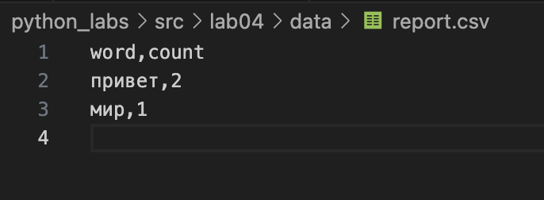
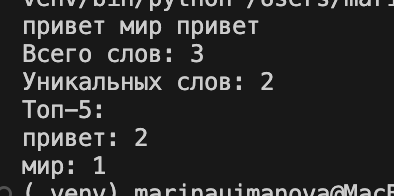

## Лабораторная работа 3

### Задание 1
```python
def normalize(text: str, *, casefold: bool = True, yo2e: bool = True) -> str:
    if text is None:
        raise ValueError
    if not isinstance(text, str):
        raise TypeError
    if len(text) == 0:
        return "" 
    if casefold:
        text= text.casefold()
    if yo2e:
        text=text.replace('ё', 'е').replace('Ё','Е')
    text=text.replace('\t', ' ').replace('\r', ' ').replace('\n', ' ')
    while '  ' in text:
        text=text.replace('  ', ' ')
    text= text.strip()
    return text
print(normalize("ПрИвЕт\nМИр\t"))
print(normalize("ёжик, Ёлка")) 
print(normalize("Hello\r\nWorld"))
print(normalize("  двойные   пробелы  "))
```
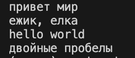

### Задание 2
```python
import re
def tokenize(text: str) -> list[str]:
    reg = r'\w+(?:-\w+)*'
    text = re.findall(reg, text)
    return text
print(tokenize("привет мир"))
print(tokenize("hello,world!!!"))
print(tokenize("по-настоящему круто"))
print(tokenize("2025 год"))
print(tokenize("emoji 😀 не слово"))
```

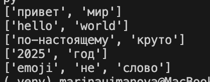

### Задание 3
```python
def count_freq(tokens: list[str]) -> dict[str, int]:
    freq_dict = {}
    if not tokens:
        return {}
    for token in tokens:
        freq_dict[token] = freq_dict.get(token, 0) +1
    return freq_dict
print(count_freq(["a","b","a","c","b","a"]))
print(count_freq(["bb","aa","bb","aa","cc"]))
```
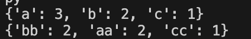

### Задание 4
```python
def top_n(freq: dict[str, int], n: int = 5) -> list[tuple[str, int]]:
    if not freq:
        return []
    items = list(freq.items())
    items.sort(key=lambda x: x[0])           # Сортировка по слову A→Z
    items.sort(key=lambda x: x[1], reverse=True)  # Сортировка по частоте 9→0
    return items[:n]
freq1 = {"a": 3, "b": 2, "c": 1}
print(top_n(freq1, 2))
freq2 = {"bb": 2, "aa": 2, "cc": 1}
print(top_n(freq2, 2))
```
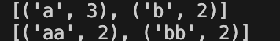

### Задание B
```python

import sys
from lib.e11_tex_stats import normalize, tokenize, count_freq, top_n
def main():
    text = sys.stdin.buffer.read().decode('utf-8') #вход к бинарным данным,преобразует строку в юникод
    if not text.strip():
        raise ValueError('Нет текста :(')
    normalized_text = normalize(text)
    tokens = tokenize(normalized_text)
    

    if not tokens:
        print("В тексте не найдено слов")
        raise ValueError

    total_words = len(tokens) # общее количество слов
    freq_dict = count_freq(tokens) # словарь частот
    unique_words = len(freq_dict) # количеситво уникальных слов 
    top_words = top_n(freq_dict, 5) # самые популярные частоты
    
    print(f"Всего слов: {total_words}")
    print(f"Уникальных слов: {unique_words}")
    print("Топ-5:")
    for word, count in top_words:
        print(f"{word}: {count}")


if name == "__main__":  
    main()
```

## Лабораторная работа 2

### Задание 1
```python
def min_max(nums: list[float | int]) -> tuple[float | int, float | int]:
    if not nums:
        raise ValueError("Пустой список!!!")
    m1=min(nums)
    m2=max(nums)
    return(m1, m2)
print(min_max([3, -1, 5, 5, 0]))
print(min_max([42]))
print(min_max([-5, -2, -9]))
print(min_max([1.5, 2, 2.0, -3.1]))
print(min_max([]))
```
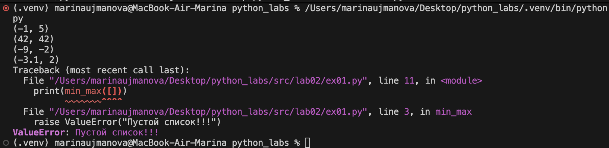

### Задание 2
```python
def unique_sorted(nums: list[float | int]) -> list[float | int]:
    return sorted(set(nums))
    
print(unique_sorted([3, 1, 2, 1, 3]))
print(unique_sorted([]))
print(unique_sorted([-1, -1, 0, 2, 2]))
print(unique_sorted([1.0, 1, 2.5, 2.5, 0]))
```

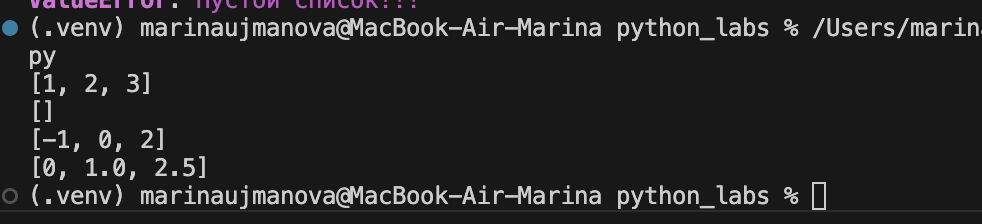


### Задание 3
```python
def flatten(mat: list[list | tuple]) -> list:
    result=[]
    for row in mat:
        if isinstance(row, (list, tuple)): #проверяю является ли row списком или кортежем
            result.extend(row) #добавляю элементы row по отдельгости в новый список
        else:
            raise TypeError
    return (result)
    
print(flatten([[1, 2], [3, 4]])) 
print(flatten([[1, 2], (3, 4, 5)]))
print(flatten([[1], [], [2, 3]]))
print(flatten([[1, 2], "ab"]))
```
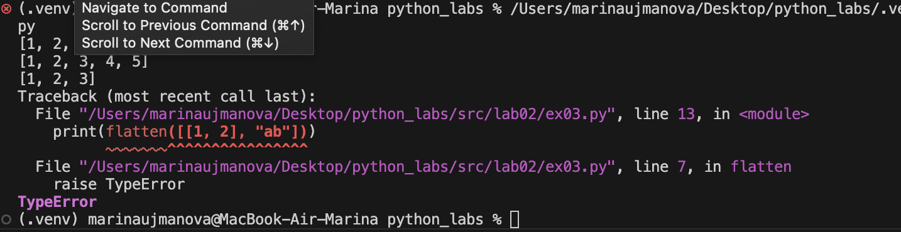

### Задание 4
```python
def transpose(mat: list[list[float | int]]):
    if not mat:
        return []
    rows=len(mat)
    cols=len(mat[0])
    for row in mat:
        if len(row)!=cols:
            raise ValueError 
        
    new_mat = [[mat[i][j] for i in range(rows)] for j in range(cols)]

    return new_mat
print(transpose([[1, 2, 3]]))
print(transpose([[1], [2], [3]]))
print(transpose([[1, 2], [3, 4]]))
print(transpose([]))
print(transpose([[1, 2], [3]]))
```


### Задание 5
```python
def row_sums(mat: list[list[float | int]]):
    if not mat:
        return []
    rows= len(mat)
    cols= len(mat[0])
    for row in mat:
        if len(row)!=cols:
            raise ValueError
    sums=[sum(row) for row in mat]
    return sums
print(row_sums([[1,2,3], [4,5,6]]))
print(row_sums([[-1, 1], [10, -10]]))
print(row_sums([[0,0], [0,0]]))
print(row_sums([[1,2], [3]]))
```
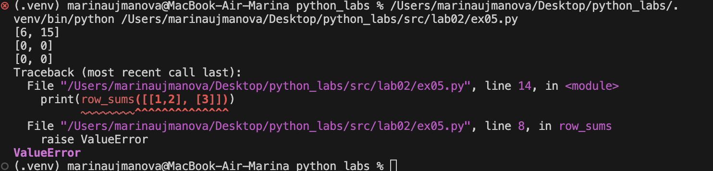

### Задание 6
```python
def col_sums(mat: list[list[float | int]]):
    if not mat:
        return []
    rows = len(mat)
    cols = len(mat[0])
    for row in mat:
        if len(row) != cols:
            raise ValueError
    sums = [sum(mat[i][j] for i in range(rows)) for j in range(cols)]
    return sums
print(col_sums([[1, 2, 3], [4, 5, 6]]))
print(col_sums([[-1, 1], [10, -10]]))
print(col_sums([[0, 0], [0, 0]]))
print(col_sums([[1, 2], [3]]))
```
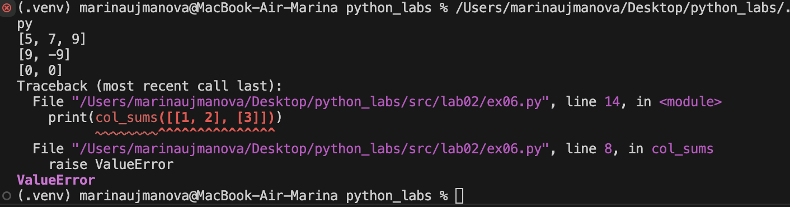

### Задание 7
```python
def format_record(student: tuple[str, str, float]) -> str:
    if len(student) != 3: 
        raise ValueError("Не хватает данных")
    if not (isinstance(student[0], str) and isinstance(student[1], str) and isinstance(student[2], float)): 
        raise TypeError
    fio_parts = student[0].split() 
    if len(fio_parts) < 2:
        raise ValueError("ФИО должно содержать фамилию и имя")
    fio_parts = [part.strip() for part in fio_parts if part.strip()]
    res = fio_parts[0].title() + " " + fio_parts[1][0].upper()
    if len(fio_parts) == 3:
        res += "." + fio_parts[2][0].upper() 
        res += "., "  
    res += " гр. " + student[1] + ", GPA " + f"{round(student[2],2):.2f}" 
    return res 
print(format_record(("Иванов Иван Иванович","BIVT-25",4.6)))
print(format_record(("Петров Пётр", "IKBO-12", 5.0)))
print(format_record(("Петров Пётр Петрович", "IKBO-12", 5.0)))
print(format_record((" сидорова  анна   сергеевна ", "ABB-01", 3.999)))
print(format_record(("Иванов Иван Иванович","BIVT-25")))
```
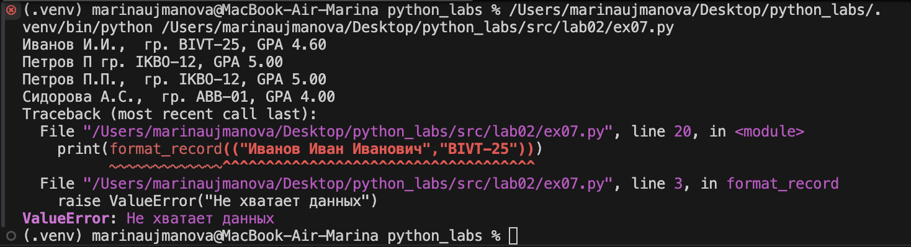


## Лабораторная работа 1

### Задание 1
```python
name=str(input("Имя: "))
age=int(input("Возраст: "))

print("Привет, " + name + "! Через год тебе будет " + str(age + 1) + ".")
```
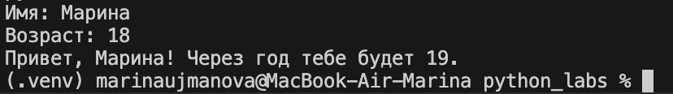

### Задание 2
```python
a = float(input('a: ').replace(',','.'))
b = float(input('b: ').replace(',','.'))
print(f"sum={round(a+b,2)}; avg={round((a+b)/2,2)}")
```

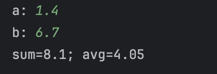

### Задание 3
```python
price=int(input())
discount=int(input())
vat=float(input())
base= price * (1 - discount/100)
vat_amount = base * (vat/100)
total= base + vat_amount
print("База после скидки:", base)
print("НДС:", vat_amount)
print("Итого к оплате:",total)
```
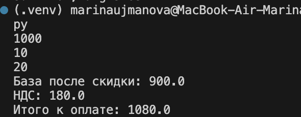

### Задание 4
```python
m=int(input("Минуты: "))
h=m//60
m1=m%60
print(f"{h}:{m1:02d}")
```
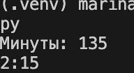

### Задание 5
```python
sec, fir, thr = map(str, input("ФИО: ").split())
print(f'Инициалы: {sec[0] + fir[0] + thr[0]}')
print(f'Длина(символы): {2+len(fir) + len(thr) + len(sec)}')

```
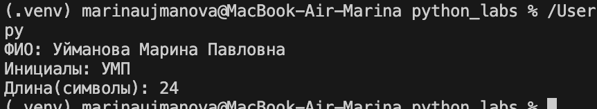


