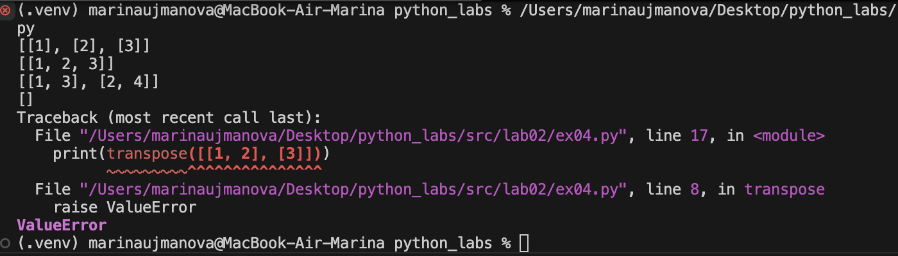

# python_labs
## Лабораторная работа 1

### Задание 1
```python
name=str(input("Имя: "))
age=int(input("Возраст: "))

print("Привет, " + name + "! Через год тебе будет " + str(age + 1) + ".")
```


### Задание 2
```python
a = float(input('a: ').replace(',','.'))
b = float(input('b: ').replace(',','.'))
print(f"sum={round(a+b,2)}; avg={round((a+b)/2,2)}")
```


### Задание 3
```python
price=int(input())
discount=int(input())
vat=float(input())
base= price * (1 - discount/100)
vat_amount = base * (vat/100)
total= base + vat_amount
print("База после скидки:", base)
print("НДС:", vat_amount)
print("Итого к оплате:",total)
```


### Задание 4
```python
m=int(input("Минуты: "))
h=m//60
m1=m%60
print(f"{h}:{m1:02d}")
```


### Задание 5
```python
sec, fir, thr = map(str, input("ФИО: ").split())
print(f'Инициалы: {sec[0] + fir[0] + thr[0]}')
print(f'Длина(символы): {2+len(fir) + len(thr) + len(sec)}')

```


## Лабораторная работа 2

### Задание 1
```python
def min_max(nums: list[float | int]) -> tuple[float | int, float | int]:
    if not nums:
        raise ValueError("Пустой список!!!")
    m1=min(nums)
    m2=max(nums)
    return(m1, m2)
print(min_max([3, -1, 5, 5, 0]))
print(min_max([42]))
print(min_max([-5, -2, -9]))
print(min_max([1.5, 2, 2.0, -3.1]))
print(min_max([]))
```


### Задание 2
```python
def unique_sorted(nums: list[float | int]) -> list[float | int]:
    return sorted(set(nums))
    
print(unique_sorted([3, 1, 2, 1, 3]))
print(unique_sorted([]))
print(unique_sorted([-1, -1, 0, 2, 2]))
print(unique_sorted([1.0, 1, 2.5, 2.5, 0]))
```


### Задание 3
```python
def flatten(mat: list[list | tuple]) -> list:
    result=[]
    for row in mat:
        if isinstance(row, (list, tuple)): #проверяю является ли row списком или кортежем
            result.extend(row) #добавляю элементы row по отдельгости в новый список
        else:
            raise TypeError
    return (result)
    
print(flatten([[1, 2], [3, 4]])) 
print(flatten([[1, 2], (3, 4, 5)]))
print(flatten([[1], [], [2, 3]]))
print(flatten([[1, 2], "ab"]))
```


### Задание 4
```python
def transpose(mat: list[list[float | int]]):
    if not mat:
        return []
    rows=len(mat)
    cols=len(mat[0])
    for row in mat:
        if len(row)!=cols:
            raise ValueError 
        
    new_mat = [[mat[i][j] for i in range(rows)] for j in range(cols)]

    return new_mat
print(transpose([[1, 2, 3]]))
print(transpose([[1], [2], [3]]))
print(transpose([[1, 2], [3, 4]]))
print(transpose([]))
print(transpose([[1, 2], [3]]))
```


### Задание 5
```python
def row_sums(mat: list[list[float | int]]):
    if not mat:
        return []
    rows= len(mat)
    cols= len(mat[0])
    for row in mat:
        if len(row)!=cols:
            raise ValueError
    sums=[sum(row) for row in mat]
    return sums
print(row_sums([[1,2,3], [4,5,6]]))
print(row_sums([[-1, 1], [10, -10]]))
print(row_sums([[0,0], [0,0]]))
print(row_sums([[1,2], [3]]))
```


### Задание 6
```python
def col_sums(mat: list[list[float | int]]):
    if not mat:
        return []
    rows = len(mat)
    cols = len(mat[0])
    for row in mat:
        if len(row) != cols:
            raise ValueError
    sums = [sum(mat[i][j] for i in range(rows)) for j in range(cols)]
    return sums
print(col_sums([[1, 2, 3], [4, 5, 6]]))
print(col_sums([[-1, 1], [10, -10]]))
print(col_sums([[0, 0], [0, 0]]))
print(col_sums([[1, 2], [3]]))
```


### Задание 7
```python
def format_record(student: tuple[str, str, float]) -> str:
    if len(student) != 3: 
        raise ValueError("Не хватает данных")
    if not (isinstance(student[0], str) and isinstance(student[1], str) and isinstance(student[2], float)): 
        raise TypeError
    fio_parts = student[0].split() 
    if len(fio_parts) < 2:
        raise ValueError("ФИО должно содержать фамилию и имя")
    fio_parts = [part.strip() for part in fio_parts if part.strip()]
    res = fio_parts[0].title() + " " + fio_parts[1][0].upper()
    if len(fio_parts) == 3:
        res += "." + fio_parts[2][0].upper() 
        res += "., "  
    res += " гр. " + student[1] + ", GPA " + f"{round(student[2],2):.2f}" 
    return res 
print(format_record(("Иванов Иван Иванович","BIVT-25",4.6)))
print(format_record(("Петров Пётр", "IKBO-12", 5.0)))
print(format_record(("Петров Пётр Петрович", "IKBO-12", 5.0)))
print(format_record((" сидорова  анна   сергеевна ", "ABB-01", 3.999)))
print(format_record(("Иванов Иван Иванович","BIVT-25")))
```


